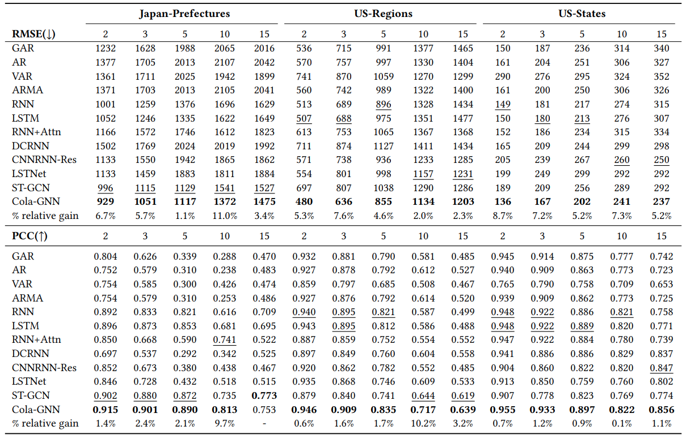

# Cola-GNN: Cross-location Attention based Graph Neural Networks for Long-term ILI Prediction  
일명 Cola-GNN으로, pre-defined graph structure를 통해 인플루엔자 데이터셋(ILI)에 대해 GNN을 학습한다.  
  
## Introduction  
- 최근, 인플루엔자 및 감염병 데이터에 대한 예측의 중요성이 높아지고 있다.  
  
- 정확한 감염병 예측은, 방역 대책을 세우는 데에 도움이 된다.  
  
- 따라서, variable간의 관계를 명확하게 파악하면서 GNN 학습을 하는 Cola-GNN 모델을 제안한다.
  - 2주 ~ 15주 까지의 예측을 진행한다.  
  
- 본 논문의 contribution은 다음과 같다.  
  - 감염병 데이터셋 예측에 적합한 GNN 모델을 제안한다.  
  - 각 노드간의 관계를 반영하기 위해서 location aware attention matrix를 생성한다.  
  - Temporal dilated convolution을 사용하여 각 노드의 temporal feature를 추출한다.  
  - 세가지 감염병 데이터셋을 통해 본 모델의 예측 우수성을 증명한다.  
  
## Related Work  
- 감염병 데이터 예측, Long-term 예측, Spatio-temporal 예측 등의 내용을 소개한다.  
  
## The Proposed Method  
  

 

### 1. Problem Formulation  
- X = [x1, x2, ... , xn] 으로 이루어지고 (각 x는 지역을 의미), 각 지역 데이터가 T 만큼의 input sequence가 있을 떄, horizon h를 예측하는 것이 목표이다.  
  
- 제안하는 모델은 세 파트로 구성된다 : 
  - variable간의 관계를 찾기 위한 location aware attention matrix 생성  
  - dilated convolution을 통해 node 정보 업데이트  
  - temporal feature와 spatial feature를 결합하기 위한 graph message passing  
  
- 필요한 notations와 descriptions는 다음과 같다.  

 

### 2. Directed Spatial Influence Learning  
- 본 파트에서 우리는, 각 변수간에 미치는 영향을 계산하여 location aware attention matrix를 구성한다.  
  
- 감염병 데이터에서의 각 노드는, 지역을 의미한다. 각 지역의 확진자 수는, 다른 지역의 확진자 수에 영향을 받을 수 밖에 없다.  
- 예를들면, 어떤 지역에서 대량의 감염자가 발생하면, 감염자들이 점차 퍼져나가면서 이웃 지역의 미감염자를 감염시키고, 이들은 또 퍼져나가게 되면서 점차 이동하게 되는것이다.  
  
- 따라서 감염병 데이터를 예측하기 위해, 본 논문에서는 geographical feature와 attention matrix를 동시에 고려한다.  
  
- 이 때, geographical feature는 이웃노드의 정보를, attention matrix는 지정학적 위치와 관계없이 시계열 데이터의 흐름이 유사한 데이터를 고려하게 된다.  
  
- Geographical feature를 위한 geographical matrix는 연구자에 의해 미리 정해진 pre-defined graph structure다.  
  
- Attention matrix를 생성하기 위해, 본 논문에서는 시계열 데이터를 RNN 모듈에 통과시키고 생성된 hidden state 들을 통해 attention score를 얻는다.  
  
- 각 element x에 대해서 RNN 을 통과 시키면 hidden state 가 다음 식에 의해서 결정된다.  

   
  
- 다음으로, 논문에서 general attention coefficient a를 다음과 같이 정의했다. 이 떄 사용된 attention은 additive attention이다.  

   
  
- 또한 attention score를 node마다 normalize하기 위해 아래 식을 이용했다.  

   
  
- 다음 final step에서, 저자들은 두 location 사이의 공간적 거리를 포함했다.  
  - Ag는 두 지역의 지리적 이웃을 나타낸 adjacency matrix이다.  
  - location aware attention matrix는 Ag와 attention coefficient matrix를 combine해서 얻는다.  
  - combination은 element wise gate M에 의해 결정된다. 이는 아래의 식과 같다.  

   
  
### 3. Multi-Scale Dilated Convolution  
- Time series의 temporal feature를 추출하기 위해 1d dilated convolution을 사용한다.  
  
- k dilation rate를 통해서 time series data feature를 추출한다.  
  
- 이렇게 추출된 feature는 graph에서 각 노드의 feature가 된다.  
  
- dilated convolution output feature vector는 다음 식과 같이 정의 된다.  

   
  
### 4. Graph Message Passing - Propagation  
- 위의 과정을 통해 cross-location attention과 local temporal feature를 추출한 후, GNN을 통해 예측하고자 한다.  
  - Graph Message Passing을 통해 이웃 노드의 정보를 가져온다.  
  - 각 노드의 정보가 h 로 표현될때, h는 다음과 같이 계산된다.  

   
  
### 5. Output Layer - Prediction  
- 각 지역에 대해서, 논문에서는 각 노드의 feature와 graph structure를 결합하여 output layer를 거쳐서 아래의 식과 같이 예측을 진행한다.  

  
  
### 6. Optimization  
- loss function은 다음과 같다.  

  
  
- 전체 알고리즘은 다음과 같다.  

  
  
  
## Experimental setup  
### 1. Datasets  
- 논문에서는 3가지 감염병 데이터셋으로 실험을 진행했다.  
  - Japan-Prefectures : 일본 현 단위의 감염병 데이터셋이다.  
  - US-States : 미국 주 단위의 감염병 데이터셋이다.  
  - US-Regions : 미국의 주를 지역별로 군집화하여 정리한 감염병 데이터셋이다.  

  
### 2. Evaluation Metrics  
- 평가지표는, RMSE와 PCC 두가지 였다. 
  
## Results  
### 1. Prediction Performance  
- 비교모델과의 실험결과는 다음과 같다.  

  
### 3.  Interpretability  
- 실제로 생성된 location aware attention matrix를 보면, 비슷한 지역끼리는 높은 attention score를, 먼 지역끼리는 낮은 attention score를 갖는다는 것을 확인할 수 있다.  

