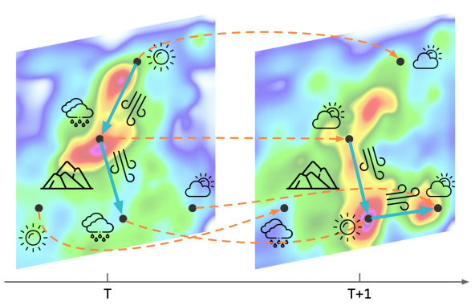
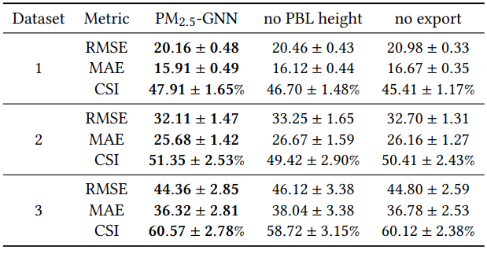

# PM2.5-GNN: A Domain Knowledge Enhanced Graph Neural Network For PM2.5 Forecasting   
일명 PM2.5-GNN으로, GNN 모델을 통한 지역별 미세먼지 농도 예측을 task로 한다. specific domain의 GNN 적용 논문.  
  
## Introduction  
- 최근, 중국 동부 공업 지대를 중심으로, 미세먼지 문제가 심각하게 발생하고 있다.  
- 이 미세먼지 중에서도 매우 작은 (2.5 마이크로미터 미만의 크기를 가진) 미세먼지를 초 미세먼지, **PM 2.5**라고 부른다.  
- 이들은 날씨의 영향에 따라 움직이며, 인간의 생활에 매우 많은 영향을 미친다.
  

  
- 초미세먼지 농도를 정확하게 예측하는 것은 어렵다.  
  1)  우선, 매우 다양한 요인의 영향을 받는다 : 공간적 특성, 발생지, 기후, 등등  
  2)  그리고, wide-range와 long-lasting 의 특성을 가진다.  
  
- 그래서 연구자들은 PM2.5의 특성을, 
  - domain-knowledge sensitivity  
  - long-term dependency  
  의 두가지로 요약했다.  
  
- 연구자들은 PM2.5 예측을 위해, GNN 모델을 개발했다.  
- Geological 정보와 meteorological 정보를 담아서 예측한다.  
- 또한, KnowAir라는 large-scale and real-world dataset을 통해 72시간 예측 모델을 학습한다.  
- 아래 그림과 같은 예측 서비스를 제공한다.  

  
  
## Related work  
- PM 2.5 prediction에 대한 기존의 연구 내용들.  
- GNN에 대한 배경지식 설명들.  
  
## Methodology  
제안하는 모델에 대한 설명을 한다.  
- 연구자들은 PM 2.5의 spatial and temporal dependencies를 통해 예측 모델을 구성했다.  
  
### 1. Studied Area and Data  
- 모델의 효과 검증을 위해서, 동경 103 ~ 122도, 북위 28 ~ 42도의 넓은 범위의 area를 선택했다.  
- 다양한 국가에서 제공한 데이터셋을 사용했다.  
  
### 2. Problem Definition  
- 우선 GNN을 위해 그래프를 구성했는데, G = (V,E) 이고, 이 때 V는 set of nodes (cities) 이며, E는 두 도시를 잇는 set of edges다.  
- P가 nodes attribute matrices, Q가 edges attribute matrices라고 할 때, 아래의 식과 같은 task를 수행한다.  

  

  
  
  
### 3. Graph Construction  
- PM 2.5는 여러 factors의 영향을 받는다. 
- 예측 성능을 향상시키기 위해서, node와 edge를 구성하는 domain knowledge가 필요하다.  
- 각 P와 Q는 다음과 같이 이루어져 있다.  

  

  
  
**Node Attribute**  
- Planetary Boundary Layer (PBL) height : 대기경계층으로, PM 2.5 농도는 PBL height와 반비례하는 경향을 보인다.  
- K index : 습한 공기의 불안정성이다. K index가 높으면 대류권 성층화가 더 불안정하다.  
- Wind speed : 풍속이다. 풍속이 높으면 PM 2.5 농도가 대개 낮다.  
- 2m Temperature : 지면에서 2m 위의 기온이다.  
- Relative humidity : 상대습도이다.  
- Precipitation : 강수량으로, PM 2.5 농도와 반비례하는 경향을 보인다.  
- Surface pressure : 기압으로, PM 2.5 농도와 비례하는 경향을 보인다.  
  
  
**Edge Attribute**  

  

  
  
- 위의 그림과 식으로 edge를 표현할 수 있는데, 이를 살펴보면 아래와 같이 설명할 수 있다.  
- S는, 바람의 흐름을 의미한다. 우선 알파는 측정하고자 하는 지점과 source지점을 이은 직선과 바람방향이 이루는 각도이고, 이에 cosine을 씌웠으므로 측정 지점으로 불어오는 방향일 때 가장 큰 값을 갖는다.  
- d는 측정 지점과 source 지점 사이의 거리이므로, 반비례한다.  
- v는 풍속의 절대값이다.  
- 여기에 ReLU를 적용하므로, cosine값이 음수가 되는, 즉 측정 지점 방향에서부터 불어나가는 바람은 S값이 0으로 설정된다.
- 또한, adjacency matrix를 구성할 때, 아래와 같은 식을 적용한다.  

  
- 이는, 두 지점 사이의 거리와 두 지점 사이의 산의 높이를 통해 연결 threshold를 준 것이다.  
- 두 지점 사이의 거리가 300km 미만이고, 두 지점 사이에 있는 산이 1200m 보다 낮으면 두 지점 사이에 PM 2.5 가 이동할 수 있다고 설정한다.  
  
### 4. PM 2.5-GNN Model  

  
- 위의 그림은 제안하는 PM 2.5-GNN 모델이다.  
  
- 예측을 진행하기 위해, spatio-temporal GRU가 사용되었다.  
- 아래 식에서 Psi와 Xi는 differentiable function을 의미한다.  

  
  
## Experiments  
### 1. Datasets  
- KnowAir라는 184개 도시의 미세먼지 데이터를 이용했다.  
- 데이터는 아래 표와 같이 3 sub-datasets로 나뉘었다.  

  
### 2. Compared Models  
- MLP, LSTM, GRU, GC-LSTM, nodesFC-GRU를 비교 모델로 사용했다.  
  
### 4. Experimental Results  
- 전체 모델의 성능은 아래의 표와 같다.  

  
  
**Importance of Domain Knowledge**  
- 연구자들은, PBL height와 transport direction information을 활용했다.  
- 이 두 정보는, PM 2.5 예측에 매우 중요하지만, 아직 제대로 적용된 적이 없었다.  
- 이 두 정보를 제거한 상태로 ablation study를 진행했고, 매우 downgrade된 성능을 확인할 수 있다.  

  
- domain knowledge가 중요하다는 것을 알 수 있다.
