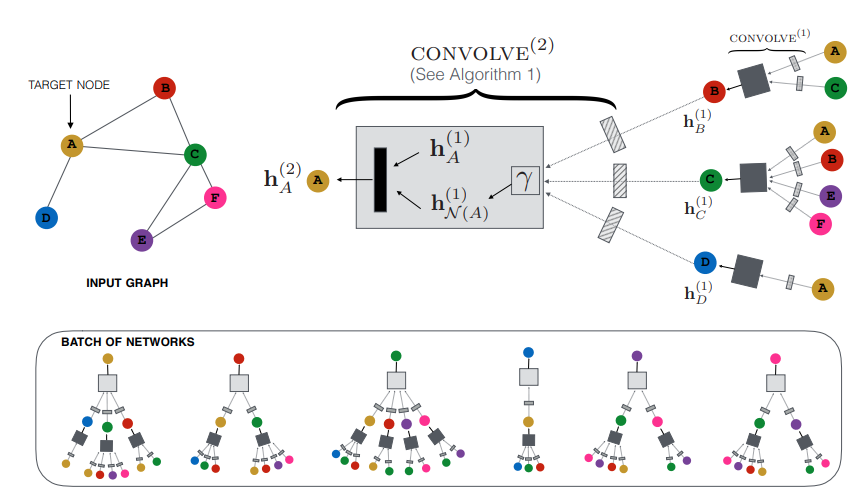
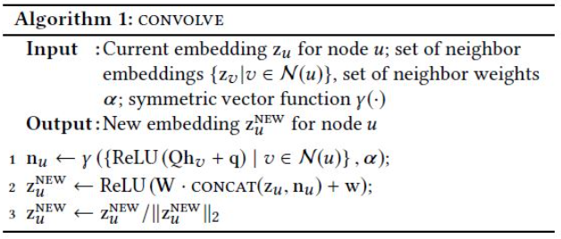

# Graph Convolutional Neural Networks for Web-Scale Recommender Systems
일명 PinSAGE이며, GraphSAGE 아이디어를 Pinterest에 추천시스템으로 적용하는 방식이다.  
관계가 포함되는 그래프의 특징을 추천시스템에 활용했다.

PinSAGE는, 사람과 아이템의 관계가 아니라 아이템간의 관계를 통해 추천한다는 개념의 모델이다.  
  
## Introduction
- GNN을 통한 추천 시스템은 이미 좋은 성능을 충분히 보이고 있지만, 매우 많은 노드와 엣지에 대해서는 아직 실제로 쓰일 수준은 아니다.  
- Random-Walk 기반의 GCN을 일반적인 경우보다 훨씬 큰 규모의 그래프 데이터셋에 적용했다.
- 크게 두 가지 측면에서 기존의 GCN 기반 모델들에 비해 향상되었다.  
     
- Fundamental advancements in scalability와 New training techniques and algorithmic innovation이다.   
   
  - **Fundamental advancements in scalability**  
      
    1. **On-the-fly convolutions**  
    사실상 GraphSAGE의 아이디어를 통해서 GNN 계산이 진행된다. 즉, PinSAGE는 노드 주변 이웃들의 정보를 sampling하고 이에 합성곱을 적용했다.  
    2. **Producer-consumer minibatch construction**  
    효과적인 Gradient 계산을 위해서 미리 정의된 그래프를 Tensorflow 모델에 태우고 GPU를 최대한 활용하여 미니배치 구조로 학습했다.  
    3. **Efficient MapReduce inference**  
    임베딩 노드 추출과정에서 분산 처리를 수행하여, 효율적인 계산이 이루어질 수 있게 했다.
  - **New training techniques and algorithmic innovation**    
     
    1. **Constructing convolution via random walks**  
    랜덤 샘플링이 아닌 Random walks를 활용해서 이웃노드를 샘플링했다.  
    2. **Importance pooling**  
    Short random walks에 기반하여 node feature 집계 방법을 이용했다.  
    3. **Curriculum training**  
    어려운 샘플링 (hard-negative sampling) 을 통한 학습을 진행하여 성능을 이끌어냈다.  
  
- PinSAGE는 실제로 Pinterest의 여러 추천 시스템에 활용되었다.  
- Pinterest에서는 시각적인 요소 (사진 등)으로 고객에게 추천을 제공하는데, 이 때 이 추천 하나하나가 Pin 이라는 요소이고, Pin 중 유사한 것들만 모아서 Board를 구성한다.  
  
## Related walks  
- GCN, GraphSAGE, Deepwalk 등에 대한 설명이다.  
- 실제로 GraphSAGE의 저자와 유사하다.  
  
## Method  

  
- PinSAGE의 전체적인 모델 구조에 대해서 알아본다.  
  
### 1. Problem Setup  
- 좋은 추천 시스템은, 각 노드를 올바르게 embedding하여 가까운 노드와 먼 노드를 판별, 혹은 노드 prediction, 노드 classification을 하는 것이다.  
- 임베딩을 학습하기 위해, 우선 노드들은 Pin과 Board로 표현한다.  
- Pin과 Board가 명확하게(?) 구분되지 않는다. 즉 일반적인 User-Item 구조는 아니다.  
### 2. Model Architecture  

  
- 위의 과정은 각 노드에 대해 임베딩 벡터를 얻는 과정이다.  
