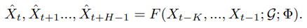
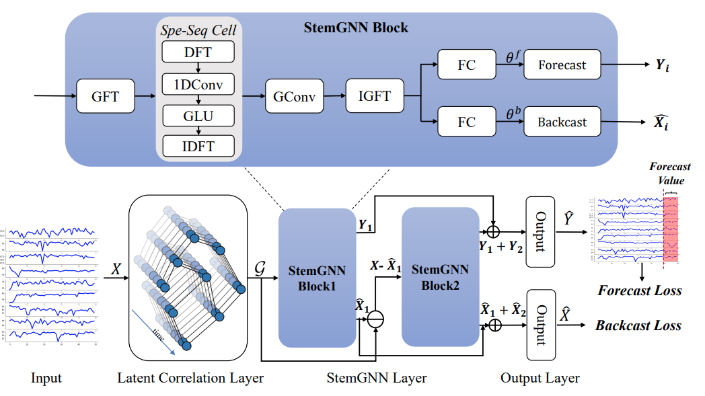
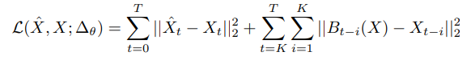
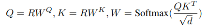
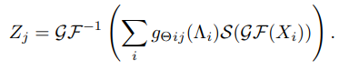
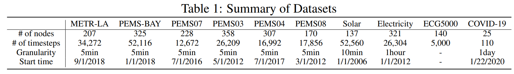
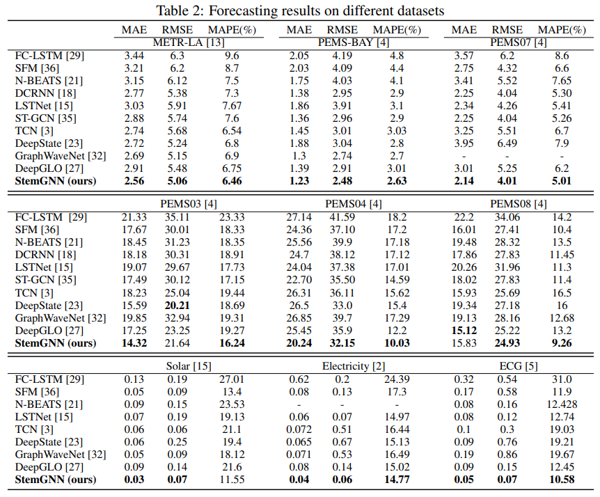
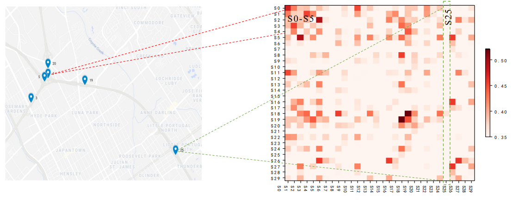
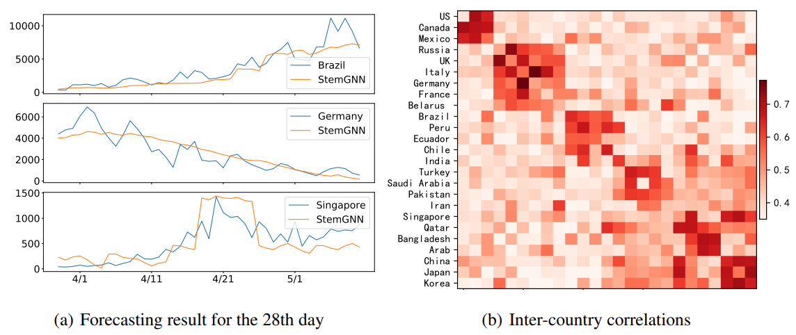

# Spectral Temporal Graph Neural Network for Multivariate Time-series Forecasting  
일명 stemGNN으로, gnn을 이용한 multivariate time series forecasting을 task로 한다.  

## Introduction  
- Multivariate Time series forecasting 을 위한 다양한 연구가 있었고, 이는 딥러닝의 발전에 힘입어 점차 높은 성능을 보여주었으며, GNN은 inter series 관계를 다른 모델들에 비해 더 잘 학습할 수 있는 장점이 있어 더욱 높은 성능을 보여주게 되었다.  
  
- 본 논문에서 제안하는 StemGNN은, Grpah structure를 설정하고, spatial 정보를 **Graph Fourier Transform (GFT)** 로, temporal 정보를 **Discrete Fourier Transorm (DFT)** 로 spectral domain으로 분해하고, 학습하여 두 정보를 combine 한다.  
  
- 본 논문은 StemGNN을 통해서 기존의 multivariate time series 예측에서 spatial 정보를 고려한 높은 예측 성능을 보인다.  
  
## Related Work  
- 기존의 다양한 Machine Learning, Deep Learning 기반의 time series 예측 기법들을 소개한다.  
  
- GNN 기반의 time series 예측 기법들을 소개하며, StemGNN 등장 배경을 소개한다.  
  
## Problem Definition  
- 본 논문에서 하고자 하는 것은, input data X 에 대해서 graph structure matrix W를 학습하고, 이 두 정보를 통해 *G*=(X,W)인 graph를 완성한다. 그리고 이를 통해 time series를 예측하게 된다.  
  
-  세부 notation은 다음과 같다. K만큼의 timestamps가 previous 정보로 들어가고, H timestamps의 미래를 예측하게 된다. 또한, node 개수 (location 개수)는 총 N개 이며, 총 timestamps는 T이다. F는 예측 모델을 의미한다. Hat을 씌운 변수는, 예측한 값이다. 이를 식으로 표현하면 아래의 식과 같다.  
  

  
  
## Spectral Temporal Graph Neural Network  

  

### 1. Overview  
- 위의 그림은, 제안하는 모델의 전체 overall architecture이다.  
  
- 제일 먼저, input data X는 Latent correlation layer에 들어가서, graph adjacency matrix W가 학습되고, output으로 도출된다.  
  
- 이후, X와 W가 결합되어 만들어진 *G*는 두 StemGNN Block이 residual 구조로 결합되어 있는 StemGNN layer로 serve 된다.  
  
- StemGNN block은, 내부에서 structural 과 temporal dependencies를 spectral domain에서 combine하도록 구성되어 있다. 우선, 내부의 GFT는, input graph *G*를 spectral matrix representation 형태로 변환하고, 이는 데이터의 각 univariate time-series를 linearly dependent하게 만든다.  그리고 이후에 적용되는 DFT는, 각 univariate time series를 frequency domain으로 변환한다.  이렇게 변환된 데이터는 1d conv와 Gated Linear Units (GLU) 에 serve되어 feature patterns를 capture하게 된다.  이후, Inverse DFT (IDFT)와 Inverse GFT (IGFT)를 통해서 원래의 데이터 형태로 회귀하게 된다.  
  
- StemGNN Block을 통과한 후, 모델에서는 GLU와 fully-connected layer로 구성된 output layer에 통과시킨다. Network에는 두 종류의 output이 생기는데, forecasting output 과 backcasting output이 그것이다.  
  **1) forecasting output**  
  - feature value에 대한 최적의 예측을 위해서 학습된다.  
    
  **2) backcasting output**  
  - multivariate time series 의 representation power(?)를 향상시키기 위해서 학습된다.  
    
  두 output loss를 결합한 final loss는 다음 식과 같다. *Xt*는 ground truth를, hat을 씌운 것은 forecasted value를 의미한다. 또한 *B*는 backcasting output에 의해서 생성된 값을 의미한다.  
  

  
  
### 2. Latent Correlation Layer  
- GNN 모델과 데이터셋에 따라, pre-defined graph structure가 존재할 수도 있지만, pre-defined graph structure가 연구자에 의해서 생성되지 않은 경우도 매우 많다 (node 개수가 많은 경우, general case 가 아닌 경우 등등). 따라서 StemGNN에서는 latent correlation layer를 통해 input data에 따라 graph structure를 학습한다.  
  
- 먼저 input data *X*는 Gated Recurrent Unit (GRU)에 들어가고, hidden state값을 통해 self attention score를 구하게 된다. 아래의 식에서 Q와 K는 Query와 Key를 의미하고, W가 최종적으로 도출되는 graph structure이다. Wk와 WQ는 learnable parameter를 의미한다.  
  

  
  
### 3. StemGNN Block  
- StemGNN은, StemGNN block 여러개를, skip connection으로 쌓아서 만든 모델이다.  
  
- StemGNN block은 Spectral Sequential (Spe-Seq) Cell과 Graph Convolution이 핵심 구조이다. 여기서는 먼저, StemGNN block의 전체 architecture와, Spe-Seq cell, 그리고 Spectral Graph Convolution을 설명한다.  
  
**StemGNN Block**  
- Spectral Graph Convolution은, multiple time series를 spectral domain에서 latent representation을 학습할 수 있다는 장점 때문에 널리 쓰이는 기술이다.  
  
- 키포인트는, GFT를 통해서 inter series relationship을 capture하는 것이다. 그런데 이를 통해서 intra series relationship을 학습할 수 없기 때문에, 내부에서 DFT를 이용한다. DFT를 이용하면, different timestamps의 periodic data의 repeated patterns나 auto-correlation feature를 학습할 수 있다.  
  
- 따라서 GFT의 output에 대해서, temporal pattern을 frequency domain에서 학습하기 위해 Spe-Seq Cell을 적용한다.  
  
- Spe-Seq Cell의 output은 Spectral Graph Convolution으로 serve 된다.  
  
- 본 모델은 multiple channel로 확장될 수 있는데, j번째 channel의 output *Zj*는 다음과 같이 표현될 수 있다. 식에서 *GF*, *GF-1*, *S*는 각각 GFT, IGFT, 그리고 Spe-Seq Cell을 의미한다.  
  

  
  
- 본 모델에서는, deeper model을 구축하기 위해서 stack multiple StemGNN blocks를 residual connection으로 연결했다. 여기서는 두개의 StemGNN blocks를 이용했다.  
  
- 두번째 block은 first block에서 reconstructed 된 value와 ground truth value사이의 residual을 잘 예측하도록 구성된다.  
  
- 두 block의 output은 concat되고 GLU와 fully connected layer로 들어가서 최종 예측값을 도출한다.  
  
**Spe-Seq Cell**  
- Spe-Seq Cell의 목표는, GFT를 거친 각 time series를 frequency로 분해하고 feature representation을 학습하는 것이다.  
  
- 네 요소로 구성된다 : **DFT, 1d conv, GLU 그리고 IDFT**가 그것이다.  
- DFT와 IDFT는 time series data를 temporal domain과 frequency domain으로 변환시킨다. 1d conv와 GLU는 frequency domain에서 feature representation을 학습한다.  
  
**Spectral Graph Convolution**  
- Spectral Graph Convolution은 3개의 step으로 구성된다.  
  1) multivariate time series는 GFT에 의해 spectral domain으로 project된다.  
  2) Spectral representation은 graph convolution에 의해서 filter된다.  
  3) IGFT는 final output을 생성하기 위해 spectral representation에 적용된다.  
  
- GFT는 Spectral Graph Convolution의 basic operator이다.  
- 이 과정은 basis가 normalized graph Laplacian의 eigenvector에 의해 construct된 orthonormal space에 input graph를 project한다.  
- 자세한 과정은 Graph Convolution 과정을 참고해야한다 (Laplacian matrix, eigenvalue decomposition ...).
  
## Experiments  
### 1. Setup  

  
  
- 위의 표와 같이, 본 논문에서는 교통, 에너지 등 다양한 real world multivariate time series dataset을 사용해서 실험했다.  
  
- FC-LSTM, DCRNN, ST-GCN, TCN, DeepGLO 등 다양한 비교 모델들로 비교실험을 구성했다.  
  
### 2. Results  

  
  
- 위의 결과에서 알 수 있듯, StemGNN은 거의 대부분의 데이터셋과 평가지표에 대해서 가장 뛰어난 예측 성능을 보여주었다.  

  
## Analysis  
### 1. Traffic Forecasting  

  
  
- 교통 데이터셋에 대해서, 제안한 모델의 latent correlation layer에서 생성된 graph structure 가 합리적인지 확인했다.  
  
- 오른쪽 그림은 생성된 graph structure이다. 그림에서 볼 수 있듯이, 가까운 지역의 교통 데이터셋에 대해서는 높은 edge weight값을 보이고, 먼 지역에 대해서는 낮은 edge weight를 보인다.  
  
### 2. COVID-19  

  
  
- 왼쪽 그림은, COVID-19 data에 대해서 StemGNN으로 예측한 결과를, 오른쪽 그림은 latent correlation layer에서 생성된 graph structure이다.  
  
- 이 역시 위와 마찬가지로, 비슷한 지역의 데이터(한국-일본-중국, 영국-독일-이탈리아 등)에 대해서는 높은 edge weight값을 보이고 서로 먼 지역에 대해서는 낮은 edge weight를 보인다.  

